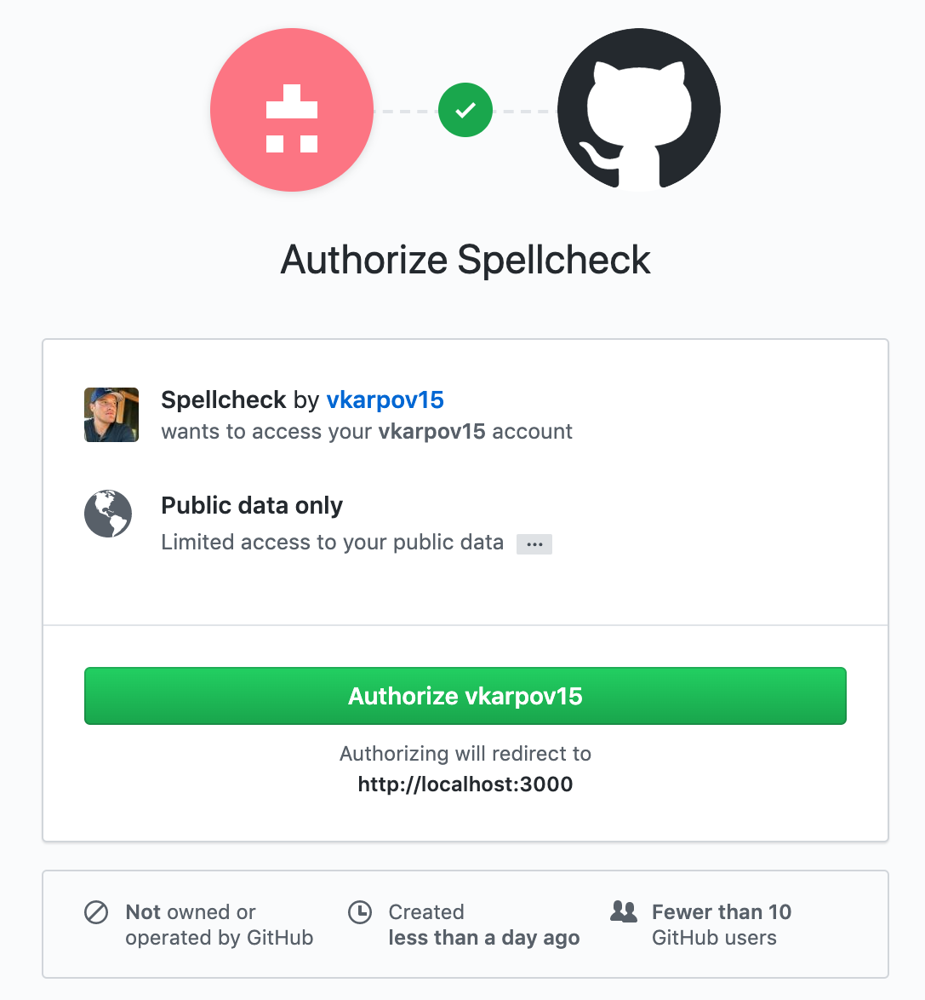
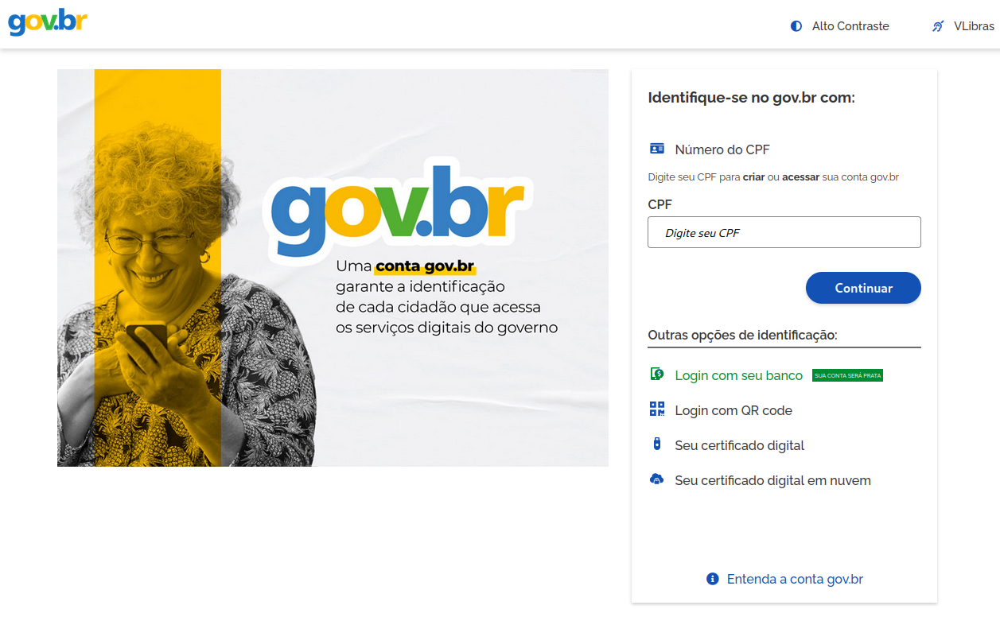
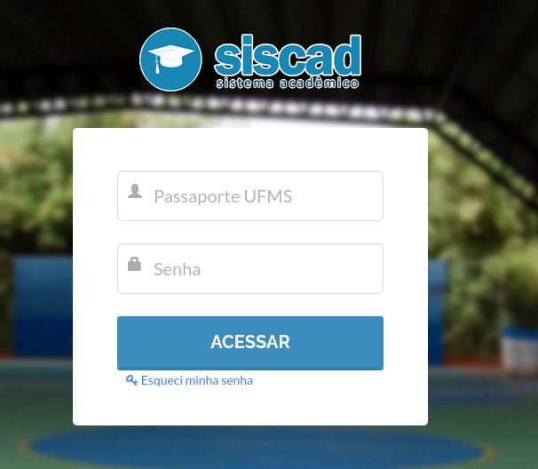
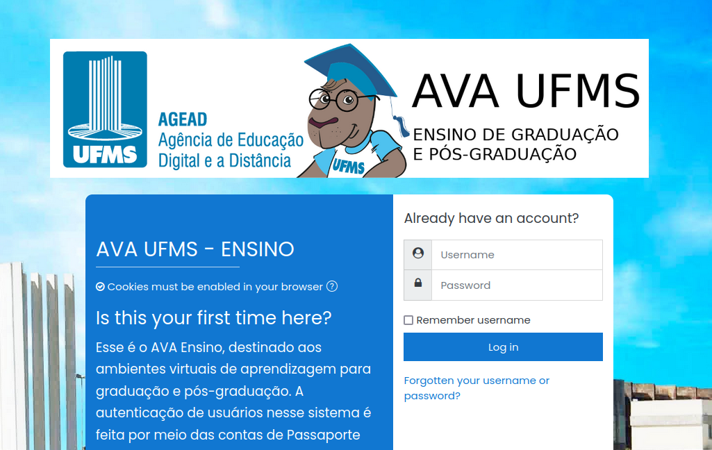

## lgpd-lesson: Introdução à autenticação e autorização: O que são e qual a diferença?

### Introdução

Você já deve ter percebido que aplicações utilizamos no nosso dia a dia, como [Google](https://developers.google.com/identity/protocols/oauth2), [GitHub](https://docs.github.com/en/developers/apps/building-oauth-apps/authorizing-oauth-apps), e recentemente até mesmo o [Gov.br](https://www.gov.br/governodigital/pt-br/conta-gov-br/conta-gov-br/) possuem um mecanismo de login bastante curioso.

Estes serviços permitem que você utilize sua conta em serviços próprios ou de terceiros sem precisar digitar suas credenciais diretamente neles, sempre lhe informando quais dados seus serão compartilhados com estes terceiros e solicitando sua autorização para tanto.

Isso é o que chamamos de _processo de autorização_. Ele é importante no contexto da proteção dos dados do usuário, pois permite que realizemos uma gestão do compartilhamento dos dados da conta, sabendo quais dados cada serviço deseja ter acesso e decidindo se desejamos compartilhar ou não esses dados.

Segundo o Gov.br, a motivação para a implementação deste processo foi:

> Dentro deste contexto, podemos destacar as diversas dificuldades com múltiplas contas de acesso sob responsabilidade do cidadão e variados bancos de dados cadastrais, tais como a **duplicidade e inconsistência de informações, falta de integração, dados dispersos e diversas formas de autenticação**. Problemas enfrentados por cidadãos ao tentar consumir um serviço público digital. Analisando essas dificuldades, o Ministério da Economia (ME), em parceria com o Serviço Federal de Processamento de Dados (Serpro), disponibilizou a plataforma central de autenticação digital do cidadão, o **Login Único**.
>
> **Essa é a nova proposta para facilitar a identificação e autenticação do cidadão**, privilegiando a governança e a convergência autoritativa, e finalmente o **controle de acesso unificado**. A Plataforma de Cidadania Digital chega para ampliar e **simplificar o acesso dos cidadãos brasileiros aos serviços públicos digitais**, inclusive por meio de dispositivos móveis. [^1]

[^1]: [Roteiro de Integração do Login Único: Contexto](https://manual-roteiro-integracao-login-unico.servicos.gov.br/pt/stable/contexto.html)

Os serviços que proveem esse processo de autorização para terceiros são chamados de Provedores de Identidade (identity providers). Esses serviços possuem um manual de como podemos integrar nossos serviços com eles. Você pode ver um exemplo disso no [manual de integração do login único Gov.br](https://manual-roteiro-integracao-login-unico.servicos.gov.br/pt/stable/iniciarintegracao.html).

Já o _processo de autenticação_, o bom e velho ato de fornecer suas credenciais (email/nome de usuário e senha) à um serviço, quando unida ao processo de autorização, pode ter sua lógica centralizada, acabando com a necessidade de criar e fornecer novas credenciais para cada serviço que utilizamos.

A união de um _processo de autorização_ e de um _processo de autenticação_ centralizado é chamada de Login Único (Single Sign On (SSO) em inglês).

Para que estes processos aconteçam de maneira padronizada, e outros serviços possam se conectar com provedores de identidade, existem os _protocolos de autorização_, sendo o mais famoso deles o [OAuth 2.0](https://oauth.net/2/), utilizado neste projeto.

### Mãos à obra

Neste projeto iremos ilustrar a implementação de um login único na UFMS, que, no momento da criação do projeto, não possui um mecanismo de autorização, fazendo com que os estudantes tenham que digitar seu passaporte UFMS e senha em todos os serviços (SISCAD, AVA, SICERT, etc.) da universidade.

### Navegação

- Anterior
- [Próximo (Desenvolvimento de uma aplicação distribuída de autorização)](./2desenvolvimento_aplicacao_autorizacao.md)
