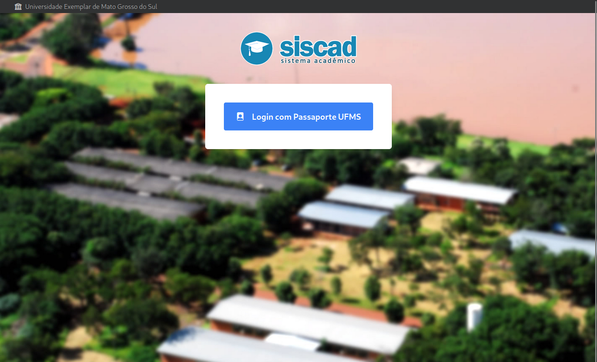

## lgpd-lesson: Desenvolvimento de uma aplicação distribuída de autorização

### Introdução

Neste projeto iremos ilustrar a implementação de um login único na UFMS e utilizá-lo para acessar o SISCAD.

### Navegação

- [Anterior (Introdução à autenticação e autorização: O que são e qual a diferença?)](./1introducao_autenticacao_autorizacao.md)
- [Próximo (Introdução à LGPD: Por que me preocupar?)](./3introducao_lgpd.md)
