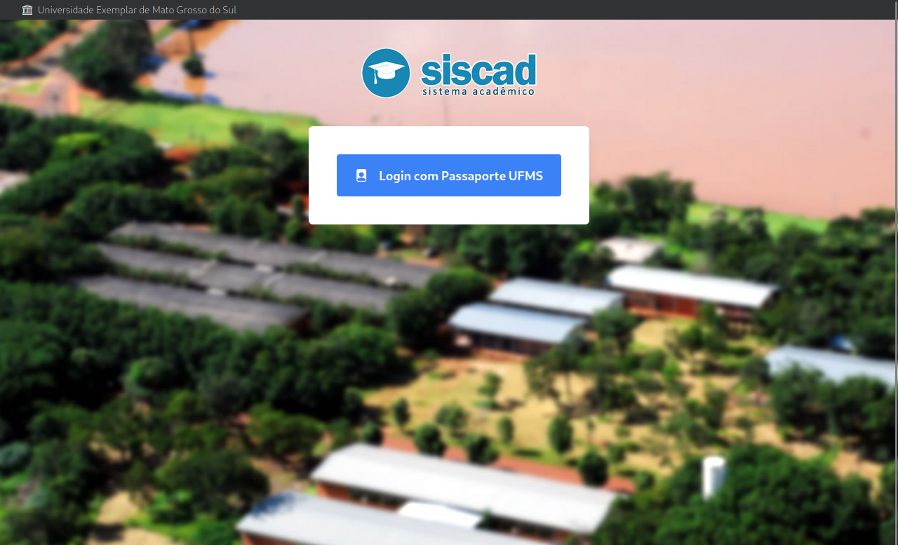
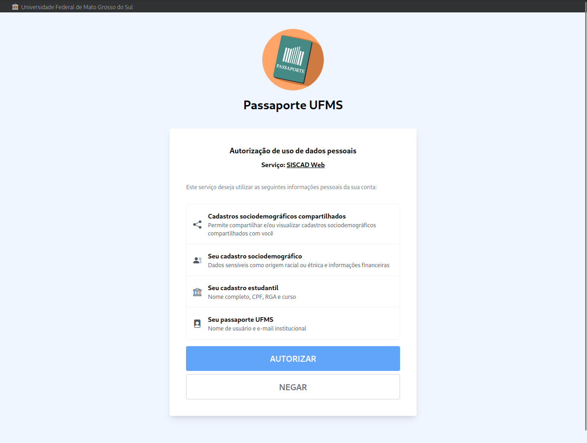

<div align="center">


## lgpd-lesson: Desenvolvimento de uma aplicação distribuída de autorização

</div>

### Introdução

Neste projeto iremos ilustrar a implementação de uma aplicação distribuída de autorização (login único) na UFMS e utilizá-lo para acessar o SISCAD.




O código fonte do back-end está disponível em [apps/passport](/apps/passport/), e o do front-end está disponível em [apps/siscad-web](/apps/siscad-web/).

Esta aplicação se utiliza do protocolo [OAuth 2.0](https://www.rfc-editor.org/rfc/rfc6749), e a estrutura das rotas foi inspirada na API do [auth0 by Okta](https://auth0.com/docs/api/authentication).

A documentação das rotas foi feita com a ferramenta Postman e pode ser encontrada em [docs/api](/docs/api/).

#### Utilização da aplicação

Para rodar a aplicação, é preciso ter o NodeJS na v16 ou maior, e o yarn na versão v1.22.19 ou maior.

A execução da aplicação é feita através dos seguintes comandos:

```sh
# Inicia o back-end do passaporte
yarn passport:dev

# Inicia o front-end do siscad
yarn siscad-web:dev
```
