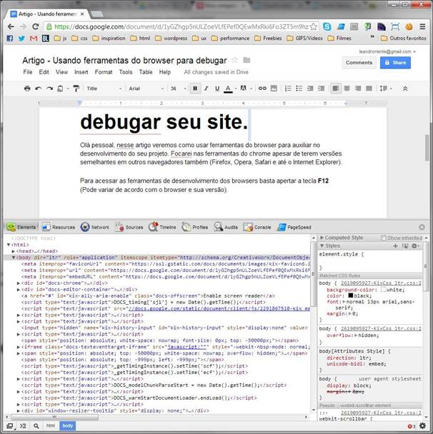

## lgpd-lesson: Introdução à técnicas de tratamento de dados pessoais sensíveis em aplicações na web

### Front-end: Uma visão geral

Aplicações front-end web estão cada vez mais populares e presentes no dia a dia dos usuários. Hoje, é bastente comum substituírmos uma suíte office nativa por suas alternativas em nuvem. Não obstante, essas aplicações também estão cada vez mais capazes de realizar coisas que antes eram realizados por aplicações desktop, como reflete o site [What Web Can do Today?](https://whatwebcando.today/), que demonstra uma série de capacidades que os chamados PWAs (Progressive Web App) têm acesso através de seu navegador que antes eram consideradas apenas disponíveis em aplicações nativas. Mas, _com grandes poderes_ sempre _vêm grandes responsabilidades_.

As aplicações que rodam nos nossos navegadores podem ser auditadas por qualquer usuário. Se você já desenvolveu alguma aplicação para a web, as _Ferramentas para Desenvolvedores_, presentes na maioria dos browsers modernos, devem ter sido suas companheiras na hora de debugar o código executado no navegador, ou visualizar as requisições feitas ao back-end.

Essa peculiaridade nos impede de manipular informações sensíveis das nossas aplicações, como as API_KEYs de algum serviço utilizado, além de fazer necessário a aplicação de algumas medidas de segurança na manipulação dos dados do próprio usuário, uma vez que vulnerabilidades como XSS (Cross Site Scripting), roubo de cookies e comunicação HTTP sem criptografia ainda são bastante presentes, e podem levar ao acesso mal intencionado desses dados.

### Técnicas para tratamento das informações no front-end

Nós vimos durante a implementação da aplicação distribuída de autorização, a utilização de uma abordagem que permite que aplicações públicas (código auditável, como as que citamos acima) deleguem à aplicações confidenciais a manipulação dessas informações mais sensíveis, como a validação das credenciais de acesso.

Uma das técnicas que vem sendo utilizada para a criação de aplicações front-end cada vez mais confidenciais é o Server Side Rendering (SSR), técnica que consiste em renderizar parte do código front-end no servidor, permitindo que as partes sensíveis do código sejam executadas num ambiente à parte do navegador do usuário. Frameworks como o [NextJS](https://nextjs.org/) e o [VueJS](https://vuejs.org/guide/scaling-up/ssr.html) permitem a utilização dessa técnica sem muita dificuldade.
Uma das variações do SSR é a hydration, que permite que renderizemos apenas parte do código javascript no navegador, enviando ele à partir do back-end e "hidratando-o" novamente no front. Um exemplo dessa técnica é utilizada no framework [Astro](https://astro.build/).

Em suma, quando se trata do desenvolvimento front-end, devemos carregar no navegador do usuário apenas aquilo que é essencial, dada a sua natureza pública. Devemos, também, sempre utilizar comunicações seguras (HTTPS, WebSockets com TLS, etc) quando formos trafegar dados sensíveis com as aplicações back-end.

### Técnicas para tratamento das informações no back-end

Já no back-end o cenário é completamente diferente. Aqui, as aplicações são naturalmente confidenciais, sendo como caixas pretas para o usuário externo. Porém, ataques como o [Ataque aos dados da TV Record](https://www.poder360.com.br/midia/ataque-a-dados-da-record-expoe-fragilidade-de-empresas-na-rede/), ainda este ano, ou o [ataque com ransomware ao STJ](https://olhardigital.com.br/2020/11/13/seguranca/stj-se-restabelece-apos-ransomware-mas-pf-investiga-copia-de-dados/), a algum tempo atrás, demonstram que confiarmos apenas na confidencialidade das aplicações back-end pode não ser o suficiente.

O que esses dois ataques têm em comum é a violação do acesso ao banco de dados, que, em ambos os casos, continham uma série de dados sensíveis para as organizações, e, conforme vimos na introdução à LGPD, o Art. 42º responsabiliza estas organizações por essas violações. Sendo assim, podemos remover sempre que possível a associação de dados sensíveis dos usuários à dados que os identifiquem como pessoas físicas, e quando não for possível, aplicarmos criptografia nos dados armazenados nos bancos de dados, para que, em caso de furto dessas informações, esses dados não possam ser relacionados aos nossos usuários. Essa técnica, prevista na LGPD, é chamada de "Anonimização".

> Art. 5º Para os fins desta Lei, considera-se:
>
> III - dado anonimizado: dado relativo a titular que não possa ser identificado, considerando a utilização de meios técnicos razoáveis e disponíveis na ocasião de seu tratamento;
>
> XI - anonimização: utilização de meios técnicos razoáveis e disponíveis no momento do tratamento, por meio dos quais um dado perde a possibilidade de associação, direta ou indireta, a um indivíduo;

Veremos, no próximo tópico, a implementação de um protocolo que realiza a criptografia dos dados do usuário, permitindo que estes sejam recuperados apenas durante sua utilização e/ou quando o usuário tenha o desejo de compartilhá-los ativamente com outros usuários.
